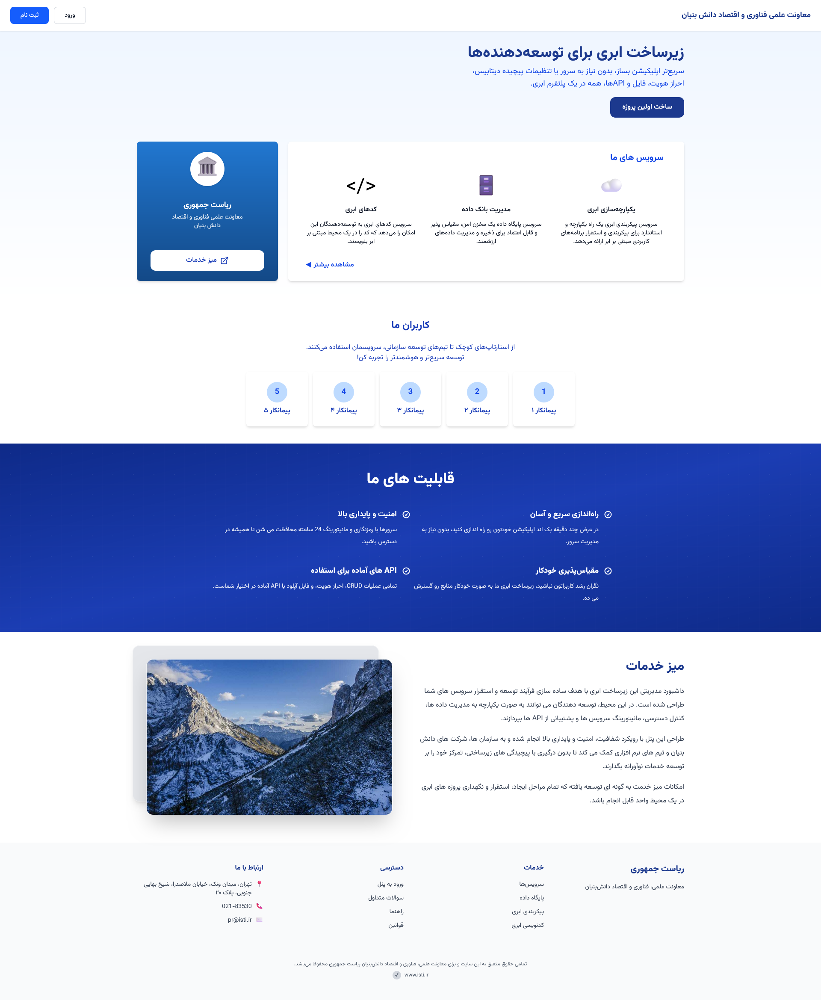
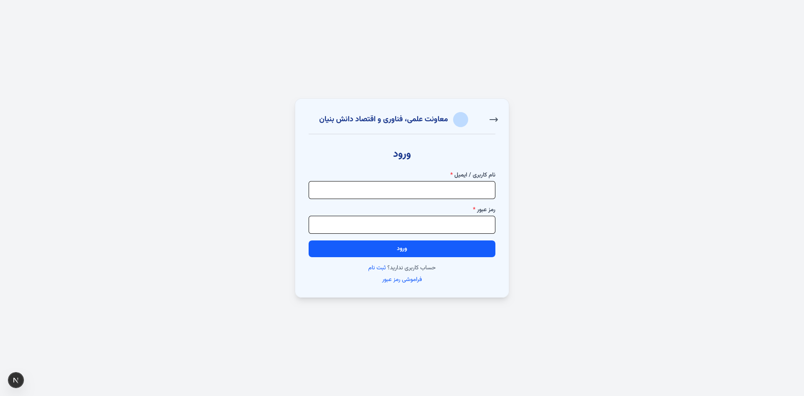
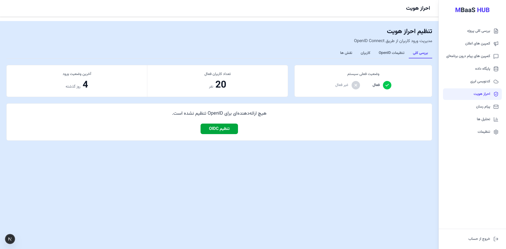
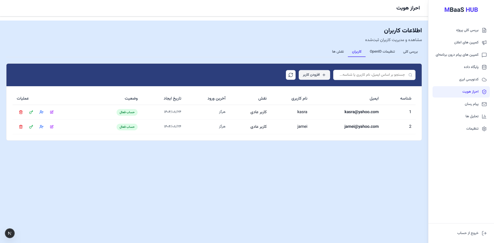
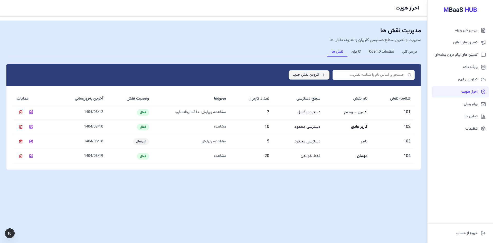

# MBAASHUB-NEXT  
## Advanced Next.js 13+ App Router Admin Panel with Auth, Role Management and Local Persistence

> A production-ready, fully typed, RTL-friendly admin dashboard built with **Next.js App Router**, **TypeScript**, **Tailwind CSS**, and **localStorage-based auth**, including **role management**, **user management**, and a reusable **notification system**.

---

## Tech Stack

---

## Features

| Feature | Description |
|--------|-------------|
| **Auth System** | Register, login, logout with email/username and password stored in `localStorage`. |
| **Case-Insensitive Credentials** | Email and username comparisons are fully case-insensitive; password is case-sensitive. |
| **Protected Routes** | All `/main/*` pages are protected by a client-side layout that checks auth token and redirects unauthenticated users to `/auth?view=login`. |
| **Role Management** | Roles CRUD using `RolesContext` with local persistence and a modern UI (modals, dropdowns, multi-select permissions). |
| **User Management** | Users list synced with auth store; create, edit, delete with confirmation modal and special warning when deleting current user. |
| **Last Login Tracking** | Last successful login timestamp is stored in `localStorage` and displayed in the users page. |
| **Reusable Notification System** | Animated toast-like notifications (success / error / warning) with a `useNotification` hook and shared `Notification` component. |
| **RTL-Ready UI** | All pages support RTL (Farsi) layout with clean typography and responsive design using Tailwind. |
| **Modular Layout** | Global sidebar + header in `app/main/layout.tsx` with per-section pages for identity overview, users, and roles. |

---

## Screenshots

---

## Getting Started

### Prerequisites

- Node.js 18+
- pnpm / npm / yarn (your choice)

### Installation

npm install

The app will be available at `http://localhost:3000`.
